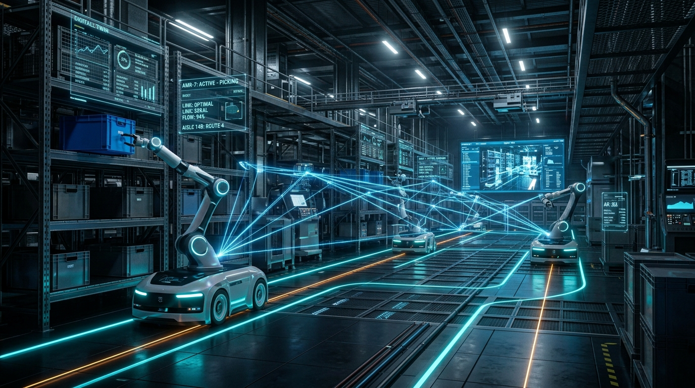
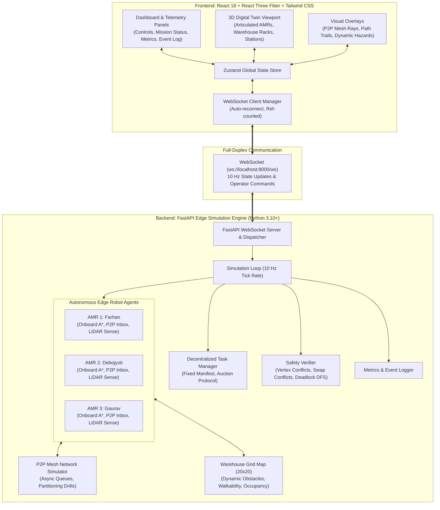

# SIH 26123 — Decentralized Edge-AI AMR Fleet Coordination & 3D Digital Twin

<div align="center">



**Decentralized Multi-Agent Autonomous Mobile Robot (AMR) Warehouse Simulation with P2P Mesh Coordination, Edge Pathfinding, Dynamic Collision Avoidance, and Real-Time 3D Digital Twin.**

[](https://python.org)
[](https://fastapi.tiangolo.com)
[](https://react.dev)
[](https://docs.pmnd.rs/react-three-fiber)
[](https://tailwindcss.com)
[](LICENSE)
[](https://sih.gov.in)

[Key Features](#key-features) • [Architecture](#system-architecture) • [Benchmarks & Empirical Results](#benchmarks--empirical-results) • [Quick Start](#quick-start) • [Demonstration Walkthrough](#demonstration-walkthrough) • [Testing & Verification](#testing--verification) • [Project Structure](#project-structure)

</div>

---

## Overview

In traditional automated warehouses, automated guided vehicles (AGVs) and AMRs rely on **centralized dispatch servers** or rigid **stop-and-wait** routing. This model introduces critical vulnerabilities:
1. **Single Point of Failure**: Server disruptions or network drops halt the entire facility.
2. **Deadlocks and Livelocks**: Uncoordinated stop-and-wait robots in narrow aisles frequently deadlock permanently when facing one another.
3. **Wi-Fi Dead Zones**: RF shielding from dense metal storage racks causes packets to drop, causing centralized systems to freeze or risk collisions.
4. **Latency Bottlenecks**: Centralized route negotiation scales poorly with fleet size.

**SIH 26123** implements a **decentralized, edge-computed multi-agent coordination architecture** paired with an **interactive WebGL 3D Digital Twin**. Every AMR acts as an autonomous edge compute node that plans routes locally, negotiates traffic dynamically over a peer-to-peer (P2P) mesh, bids on task manifests, resolves deadlocks cooperatively, and degrades gracefully to onboard LiDAR proximity sensing during total communication blackouts.

---

## Key Features

### 1. Decentralized Multi-Agent Coordination (Edge AI)
* **Local Autonomy**: No central routing brain. Robots maintain their own internal belief state, compute their own A* paths, and adapt dynamically to traffic.
* **P2P Mesh Network**: Robots exchange broadcast and targeted messages (`pos` for positions, `intent` for lookahead paths, `bid` for auction bids, and `blocked` for dynamic hazard gossip).
* **Distributed Task Auctions**: Staged cargo packages are allocated via a decentralized contract net / bid auction protocol where idle units compute bids based on proximity and battery reserves.

### 2. Rigorous Collision & Deadlock Resolution
* **Hybrid Conflict Invariants**:
  * **Vertex Conflicts**: Prevents two robots from occupying the same grid cell.
  * **Swap Conflicts (Edge Conflicts)**: Prevents two robots from traversing the same edge in opposite directions during the same tick (i.e., driving straight through each other).
* **Dynamic Lookahead Intent Negotiation**: Robots broadcast their next 5 planned steps (`LOOKAHEAD_WINDOW`). If trajectories intersect within critical zones, units negotiate priority based on remaining distance-to-goal and deterministic tiebreakers.
* **Polite Yielding**: Idle robots proactively step aside into empty adjacent aisles when an active transport robot approaches.
* **Cycle Deadlock Detection (DFS)**: Automatically detects circular wait conditions ($A \to B \to C \to A$) using depth-first search on a dynamic wait-for graph. Resolves deadlocks deterministically by having the highest-ID robot yield and back out.

### 3. Wi-Fi Dead Zone Resilience (Graceful Degradation)
* **Onboard Sensor Fallback**: Simulates onboard LiDAR bumper sensing ($5\text{ m}$ Manhattan range).
* **Fault Tolerant**: When an AMR enters a simulated radio dead zone (partitioned from P2P traffic), it relies strictly on physical proximity sensing. It safely navigates and avoids collisions without receiving or broadcasting peer packets.

### 4. High-Fidelity 3D Digital Twin (React Three Fiber)
* **Articulated Humanoid AMRs**: Procedural 3D humanoid robots featuring articulated shoulders, elbows, hips, knees, independent pivot joints, and inverse-kinematic walking swing.
* **Physical Cargo Handling Dwell**: Robots physically walk up to loading tables, reach out with grippers, lift labeled cartons, carry them secured in front of their torso, and lower them onto delivery tables with a 10-tick dwell animation.
* **Photorealistic Warehouse Environment**: 20×20 grid floor, instanced high-density pallet racks, loading bays, delivery dispatch tables, floor markings, inductive charging pads, and directional signage.
* **Dynamic Overlays**:
  * **P2P Mesh Rays**: Visual beams representing live peer-to-peer radio transmissions.
  * **Path Trails**: Color-coded planned route projections.
  * **Hazard Zones**: Real-time barricade rendering on blocked aisles.
* **Camera Modes**:
  * `Overview`: Isometric bird's-eye perspective of the full facility.
  * `Top-down`: 2D orthographic warehouse floor plan view.
  * `Follow selected`: Third-person tracking camera locked onto a chosen robot.
  * `Receiving` & `Dispatch`: Dedicated bay vantage points.
  * `Manual orbit`: Free 360° inspection controls.
* **Rack Visibility Modes**: `Full racks` (solid industrial warehouse), `X-ray racks` (semi-transparent for tracking obscured robots), and `Low-rack` (clean aisle view).

### 5. Interactive Disruption Drills
* **Live Aisle Blocking**: Pause the simulation and draw physical barricades directly onto the floor canvas (or click "Auto-block a route"). On resume, the fleet gossips the hazard over the P2P mesh and reroutes on-the-fly using onboard A*.
* **Wi-Fi Dead Zone Injection**: Cut the radio link of any individual unit with a single click to demonstrate real-time offline survival and LiDAR-based obstacle avoidance.

---

## System Architecture



---

## Benchmarks & Empirical Results

The coordination algorithm was evaluated using the **headless benchmark suite** (`backend/test_simulation.py`) against the standard industry baseline.

### Experimental Setup
* **Episodes**: 100 consecutive deterministic Monte Carlo runs.
* **Fleet**: 3 Autonomous Mobile Robots.
* **Grid**: 20×20 discrete warehouse environment with aisle choke points and cross-warehouse cargo routes.
* **Workload**: Fixed manifest where 6 packages are staged on west loading tables and transported across the floor to east delivery tables. Both algorithms receive identical start coordinates and manifest pairings.
* **Audit**: Exact verification of vertex collisions (same cell) and swap collisions (simultaneous cross-through), with timeout episodes excluded from time averages.

### Benchmark Results

| Metric | Traditional Stop-and-Wait Baseline | Decentralized Edge-AI Fleet | Improvement / Verdict |
| :--- | :---: | :---: | :---: |
| **Same-Cell Collisions** | 0 | **0** | **100% Zero-Collision Guarantee** |
| **Swap / Edge Collisions** | 0 | **0** | **100% Zero-Collision Guarantee** |
| **Permanent Deadlocks (Naive)** | **96 / 100 (96%)** | **0 / 100 (0%)** | **Deadlocks Completely Eliminated** |
| **Completion Rate** | 4% (Naive) / 100% (with backoff) | **100 / 100 (100%)** | **100% Mission Reliability** |
| **Avg. Ticks (1.0s stall tolerance)** | 100.2 ticks | **81.0 ticks** | **19.2% Faster** |
| **Avg. Ticks (1.5s stall tolerance)** | 109.6 ticks | **81.0 ticks** | **26.1% Faster** |
| **Avg. Ticks (2.0s stall tolerance)** | 118.3 ticks | **81.0 ticks** | **31.5% Faster** |

> [!NOTE]
> Textbook stop-and-wait (plan once, halt when blocked, never replan) deadlocks permanently in 96% of episodes because opposing robots in narrow aisles cannot negotiate. When the baseline is given an industrial backoff escape hatch (re-running A* after $N$ stalled ticks), our decentralized fleet consistently outperforms it by **19.2% to 31.5%** in completion speed while maintaining zero collisions.

---

## Quick Start

### Prerequisites
* **Python**: 3.10 or higher
* **Node.js**: 20 or higher (Node 22 LTS recommended)
* **Package Managers**: `pip` and `npm`

---

### 1. Backend Setup

Open a terminal and start the FastAPI simulation engine:

```bash
cd backend

# Install dependencies
python -m pip install -r requirements.txt

# Start the simulation server on port 8000
uvicorn main:app --host 0.0.0.0 --port 8000 --reload
```

* Backend API: `http://localhost:8000`
* WebSocket Endpoint: `ws://localhost:8000/ws`
* Swagger Documentation: `http://localhost:8000/docs`

---

### 2. Frontend Setup

In a second terminal, launch the React Three Fiber digital twin:

```bash
cd frontend

# Install dependencies
npm ci

# Start the Vite development server
npm run dev
```

* Open your browser at: **`http://localhost:5173`**
* *(Optional)*: If running the backend on a remote host, set `VITE_WS_URL=ws://<host>:8000/ws` in a `.env` file in `frontend/`.

---

## Demonstration Walkthrough

Follow this step-by-step evaluation guide to explore all system capabilities:

```
+-----------------------------------------------------------------------------+
|                               DEMO WORKFLOW                                 |
|                                                                             |
|  [1. Start Demo]  -->  [2. Select Unit & Follow]  -->  [3. Observe Pickup]  |
|         |                                                       |           |
|         v                                                       v           |
|  [4. Disruption Drill: Barricade]                 [5. Disruption Drill: RF] |
|   * Pause simulation                               * Toggle Dead Zone       |
|   * Paint barrier across aisle                     * Unit navigates via     |
|   * Resume & observe A* reroute                      onboard LiDAR bumper   |
+-----------------------------------------------------------------------------+
```

1. **Initial Inspection**:
   * Open `http://localhost:5173`. Confirm the connection badge displays **`Connected · Ready`**.
   * Notice the 6 packages staged on the West loading tables (`LOADING 1` to `LOADING 6`).
2. **Start Simulation**:
   * Set playback speed to `0.5x` or `0.25x` for clear observation.
   * Click **`Start demonstration`**.
3. **Inspect Cargo Transfer Dwell**:
   * Click on robot card **Farhan** in the dashboard and select **`Follow selected`** in Camera Presets.
   * Watch the unit navigate to its assigned loading table. Notice the 10-tick handling dwell: the robot reaches out its grippers, secures carton `#1`, lifts it, and turns towards the destination.
   * The package is carried directly in front of the torso during transport.
4. **Disruption Drill 1: Dynamic Aisle Barricade**:
   * Click **`Pause`**.
   * Click **`Place barriers`** in the Disruption Drills section.
   * Click or drag across an active aisle to create physical obstacles.
   * Click **`Resume`**.
   * Watch the fleet gossip the blocked cells over the P2P mesh (`hazard` event) and reroute seamlessly using onboard A* without collisions.
5. **Disruption Drill 2: Wi-Fi Dead Zone Partition**:
   * Click on **`Farhan ✕`** in the Wi-Fi Dead Zone controls.
   * The robot loses radio connectivity (P2P packets blocked).
   * Notice the AMR continues navigating safely, avoiding peer collisions purely via onboard proximity sensing.
   * Click the button again to reconnect the unit to the mesh.
6. **Delivery & Completion**:
   * Follow the unit to `DELIVERY 6` on the East side.
   * Watch the robot lower and release the carton. Delivery counters update strictly upon physical placement.

---

## Testing & Verification

The project includes an automated test suite spanning backend contracts, distributed collision invariants, and frontend components:

### 1. Headless Simulation Benchmark (100 Episodes)
Runs 100 full episodes of decentralized fleet coordination vs. baseline:

```bash
cd backend
python test_simulation.py
```

### 2. Presentation Handling Contract Tests
Validates cargo ownership transfer, dwell ticks, and reset safety:

```bash
cd backend
python -m unittest discover -p "test_presentation_contract.py" -v
```

### 3. Frontend Math & Motion Unit Tests
Validates coordinate transforms, yaw wrapping, right-angle turns, and WebSocket handling:

```bash
cd frontend
npm test
```

### 4. Frontend Production Build
Validates bundle compilation and asset optimization:

```bash
cd frontend
npm run build
```

---

## Project Structure

```
RobotSim/
├── assets/
│   └── banner.jpg                   # High-resolution README banner image
├── backend/
│   ├── baseline.py                  # Stop-and-wait baseline controller (naive & backoff)
│   ├── collision.py                 # Vertex & swap collision detection, deadlock DFS cycle finder
│   ├── config.py                    # Warehouse dimensions, tick rates, battery, sensor parameters
│   ├── events.py                    # In-memory circular event logger for telemetry
│   ├── main.py                      # FastAPI application, WebSocket dispatch, simulation loop
│   ├── metrics.py                   # Real-time and cumulative benchmark metrics tracker
│   ├── p2p.py                       # Simulated asynchronous P2P mesh network & network partitions
│   ├── pathfinding.py               # Local grid A* search implementation
│   ├── presentation_robot.py        # Robot subclass with handling dwell ticks for web demo
│   ├── requirements.txt             # Backend Python dependencies (FastAPI, Uvicorn, WebSockets)
│   ├── robot.py                     # Autonomous edge AMR agent logic (local state, negotiation, bids)
│   ├── task_manager.py              # Manifest generator & decentralized contract net auction
│   ├── test_presentation_contract.py # Unit tests for cargo transfer contract
│   ├── test_simulation.py           # 100-episode headless benchmark and verification suite
│   └── warehouse.py                 # Warehouse grid layout, walkability queries, occupancy map
├── frontend/
│   ├── index.html                   # HTML entry point with WebGL viewport
│   ├── package.json                 # Frontend dependencies and test scripts
│   ├── vite.config.js               # Vite bundler configuration
│   └── src/
│       ├── App.jsx                  # Main application shell and layout
│       ├── main.jsx                 # React root mounting
│       ├── store.js                 # Zustand central telemetry and UI state store
│       ├── websocket.js             # Resilient WebSocket connection manager
│       ├── components/
│       │   ├── BlockedAisle.jsx     # 3D interactive hazard barriers & placement tool
│       │   ├── CameraController.jsx # Camera preset animations (Overview, Follow, Bays)
│       │   ├── CargoBox.jsx         # Procedural package geometry with local canvas labels
│       │   ├── P2PLines.jsx         # Live 3D P2P radio transmission rays
│       │   ├── PathTrail.jsx        # Planned path breadcrumb ribbons
│       │   ├── Robot.jsx            # Articulated humanoid AMR 3D model & IK gait
│       │   ├── Robots.jsx           # Fleet collection renderer
│       │   ├── Scene.jsx            # Three.js Canvas, lighting, shadows, and environment
│       │   ├── Signage.jsx          # 3D hanging bay signs and status indicators
│       │   └── Warehouse.jsx        # Instanced racks, floor markings, tables, chargers
│       ├── dashboard/
│       │   ├── Controls.jsx         # Simulation controls, speed, drills, camera presets
│       │   ├── Dashboard.jsx        # Sidebar container and layout
│       │   ├── EventLog.jsx         # Real-time chronological event feed
│       │   ├── MetricsPanel.jsx     # Live performance and comparison metrics
│       │   ├── RobotStatus.jsx      # Individual fleet unit telemetry cards
│       │   └── TaskQueue.jsx        # Staged, active, and delivered task lists
│       └── utils/
│           ├── presentation.js      # Kinematics, heading math, and motion interpolation
│           ├── simulationState.js   # Cargo lifecycle and mission summary helpers
│           └── socketClient.js      # Pure WebSocket protocol client
└── README.md                        # Project documentation
```

---

## Configuration & Tuning

Key simulation and physical parameters can be customized in [`backend/config.py`](./backend/config.py):

| Constant | Default | Description |
| :--- | :---: | :--- |
| `GRID_WIDTH`, `GRID_HEIGHT` | `20, 20` | Warehouse dimensions ($20\text{ m} \times 20\text{ m}$) |
| `NUM_ROBOTS` | `3` | Active autonomous mobile robots in the fleet |
| `ROBOT_NAMES` | `["Farhan", "Debojyoti", "Gaurav"]` | Human-readable identity names for units |
| `TICK_RATE` | `10` | Simulation frequency ($10\text{ Hz} = 0.1\text{s}$ per tick) |
| `SENSOR_RANGE` | `5` | Onboard LiDAR proximity sensing radius in cells |
| `LOOKAHEAD_WINDOW` | `5` | Trajectory steps broadcasted in intent packets |
| `REPLAN_AFTER_WAITS` | `3` | Consecutive wait ticks before forcing an onboard A* reroute |
| `BATTERY_MAX` | `100.0` | Maximum unit battery capacity |
| `BATTERY_DRAIN_PER_MOVE` | `0.5` | Battery drain per cell movement |
| `BATTERY_LOW_THRESHOLD`| `20.0` | Threshold triggering autonomous detour to charging pad |

---

## Technology Stack

* **Backend Engine**: [FastAPI](https://fastapi.tiangolo.com/), [Uvicorn](https://www.uvicorn.org/), [WebSockets](https://websockets.readthedocs.io/), Python `asyncio`
* **Algorithms**: Decentralized Multi-Agent A*, Contract Net Protocol (Bid Auction), DFS Cycle Detection, Lookahead Intent Exchange
* **Frontend Digital Twin**: [React 18](https://react.dev/), [React Three Fiber (R3F)](https://docs.pmnd.rs/react-three-fiber), [Three.js](https://threejs.org/), [@react-three/drei](https://github.com/pmndrs/drei)
* **UI & Telemetry**: [Tailwind CSS v4](https://tailwindcss.com/), [Zustand](https://github.com/pmndrs/zustand), [Recharts](https://recharts.org/)
* **Build Tooling**: [Vite](https://vitejs.dev/)

---

## License & Acknowledgments

This project is licensed under the [MIT License](LICENSE).

Developed for **Smart India Hackathon (SIH 26123)** — *Autonomous Fleet Coordination in Modern Warehouses*.
Special thanks to the open-source communities behind Three.js, React Three Fiber, and FastAPI.
